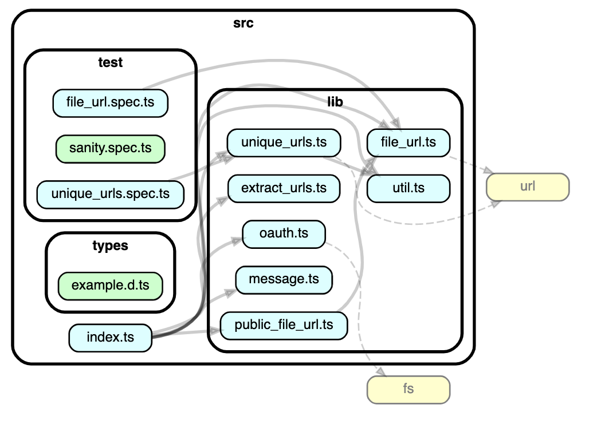

# Contributing

## Overview

At a high level, my program works like this:

1. It launches a server at localhost:7777 that redirects you to a login page
2. Once you log in, the program receives an OAuth token it uses to start scanning your emails
3. We log each message to the console as we scan it, along with any public file URLs we found.
   At the end, we list all the unique public file URLs we found, along with some basic stats (# of emails scanned, # successful scans, # failed scans).
4. Well, we don't actually log to the console. If you run `yarn start`, we pipe the console output to a [frontail](https://github.com/mthenw/frontail) server, so you can follow the output in the browser.

## Email scanning

Email scanning in particular works like this:

1. Get the IDs for the emails in your inbox, using Gmail's Node SDK
2. For each ID, get the message associated with that ID
3. Then, for each message, parse its MIME content tree to find the message's text/plain and text/html parts, as well as any plaintext file attachments
4. Extract and concatenate all the text from these parts/attachments
5. Use the [`get-urls`](https://github.com/sindresorhus/get-urls) to get all the URLs from the text
6. Narrow down the URLs to those that look like Google Drive or Dropbox file URLs
7. Make a request to all these URLs to determine which file URLs are public (based upon status code)
8. Combine our URLs from all messages, de-duplicate, and return the resulting list

## Code structure

- `src/index.ts` - creates Express server for auth, includes main function for scanning emails
- `src/message.ts` - gets message IDs and retrieves messages, for steps 1 and 2 above
- `src/lib/extract_urls.ts` - exposes `getUrlsFromMessage`, which given a message does steps 3 to 5 above
- `src/lib/file_url.ts` - exposes `getFileUrls`, which does step 6 above
- `src/lib/public_file_url.ts` - exposes `getPublicUrls`, which does step 7 above
- `src/lib/unique_urls.ts` - exposes `getUniqueUrls`, which de-duplicates a list of URLs for step 8 above

### Dependency graph

This graph was generated by [dependency-cruiser](https://github.com/sverweij/dependency-cruiser).

